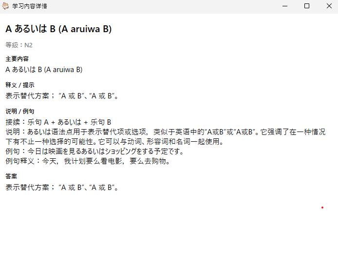
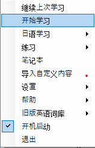

# Nihongo ToastFish

> 一个常驻 Windows 托盘的低打扰日语学习工具。  
> 通过系统通知弹窗学习日语词汇、语法和例句，适合在电脑前碎片化复习。

[项目地址](https://github.com/pullead/Nihongo-ToastFish) · [上游 ToastFish](https://github.com/Uahh/ToastFish) · [架构决策](docs/decisions/ADR-001-base-on-toastfish-and-content-packs.md)

---

## 项目简介

Nihongo ToastFish 基于开源项目 ToastFish 改造，保留了托盘常驻、Windows 通知弹窗、快捷键、SQLite、本地导入、学习日志和 SM2 复习调度等能力，并将学习方向调整为日语优先。

当前重点是让软件安装后即可直接学习：

| 内容 | 状态 |
| --- | --- |
| N5-N1 日语词汇 | 已内置参考内容 |
| N5-N1 日语语法 | 已内置参考内容 |
| N5-N1 语法例句 | 已内置参考内容 |
| 中文释义与说明 | 已覆盖词汇、语法、例句主要字段 |
| 五十音学习 | 保留并可直接使用 |
| 学习笔记本 | 支持词汇、语法、例句自动归类 |
| 笔记导出 | 支持 Excel、CSV、PDF |
| 安装包 | 已提供 3.0 EXE 安装包 |

JLPT 等级内容是学习参考内容，不代表官方完整考纲。

---

## 界面预览


| 学习内容详情 | 托盘菜单 |
| --- | --- |
|  |  |

---

## 主要功能

### 日语学习

- N5-N1 词汇预览与学习
- N5-N1 语法预览与练习
- N5-N1 例句学习，例句中可显示关联语法知识
- 语法学习中显示对应例句解释
- 五十音顺序学习与练习
- 保留旧版英语词库，作为兼容功能

### 通知弹窗

- 学习内容通过 Windows 通知弹窗展示
- 默认使用左下角自定义学习弹窗，也可切换回 Windows 原生通知模式
- 支持上一个、下一个、暂停、详情、添加笔记
- 关闭弹窗会暂停当前学习，避免继续弹出下一条
- 弹窗详情可展开查看较长的解释内容
- 自定义弹窗会尽量显示完整内容，减少频繁打开详情的需要
- 词汇和语法标题使用灰色底色高亮，例句中出现的对应词汇或语法也会同步高亮
- 会记忆上一次退出时的词库和学习进度

### 词汇与语法预览

- 词汇预览重新排版，词汇归属、假名、词性、释义、例句和相关语法分区显示
- 当前内置词汇数据保留了 JLPT/教材来源标签；若词性暂未标注，会显示为“未标注”
- 词汇例句会优先从本地例句库匹配不同句子，避免“例句”和“语法例句”重复
- 语法预览支持显示两条例句及对应中文解释
- 例句学习会显示选项对应中文释义，并补充使用到的语法知识

### 学习笔记本

- 在学习中点击“添加笔记”即可保存当前内容
- 自动按词汇、语法、例句分类
- 支持单击选中、Ctrl 多选
- 右键可标记重点颜色、标记已复习、删除
- 标记已复习和删除都会从笔记本中移除
- 可导出为 Excel、CSV、PDF，颜色重点标记会一并保留

### 快捷键

| 快捷键 | 功能 |
| --- | --- |
| `Alt + Q` | 继续上次学习 |
| `Alt + A` | 上一个 |
| `Alt + D` | 下一个 |
| `Alt + W` | 关闭当前弹窗并暂停 |
| `Alt + S` | 添加当前内容到笔记本 |
| `Alt + E` | 打开或关闭详情 |
| `Alt + 1` 到 `Alt + 4` | 对应通知按钮 1 到 4 |
| `Alt + ~` | 播放当前发音 |
| `Ctrl + Alt + J` | 继续上次学习 |
| `Ctrl + Alt + V` | 从 N5 词汇开始 |
| `Ctrl + Alt + G` | 从 N5 语法开始 |
| `Ctrl + Alt + E` | 从 N5 例句开始 |
| `Ctrl + Alt + P` | 暂停当前学习 |
| `Ctrl + Alt + O` | 显示或隐藏主窗口 |

全局快捷键会尽量避开 Edge 浏览器，减少与浏览器快捷键冲突。

---

## 安装包

已经支持生成给普通用户使用的单独安装包。3.0 版本安装包已保存在仓库根目录和 `dist/installers`：

```text
Nihongo-ToastFish-Setup-v3.0.exe
Nihongo-ToastFish-Setup.exe
```

```text
dist\installers\Nihongo-ToastFish-Setup.exe
```

安装包行为：

- 安装到 `%LOCALAPPDATA%\Programs\Nihongo ToastFish`
- 创建桌面快捷方式
- 创建开始菜单快捷方式
- 注册 Windows“应用和功能”卸载项
- 安装完成后自动启动软件
- Windows“应用和功能”中显示版本为 `3.0.0`

由于当前安装包未做代码签名，首次运行时 Windows SmartScreen 可能会提示风险，这是未签名开源软件常见现象。

旧版本已通过 GitHub 分支和标签保留：

- `release-v2.0`
- `v2.0.0`
- `v3.0.0`

---

## 本地开发

### 环境要求

- Windows 10 或 Windows 11
- Visual Studio 2019 或更新版本
- .NET Framework 4.7.2 Targeting Pack
- NuGet
- MSBuild

### 构建 Debug

```powershell
nuget restore ToastFish.sln
msbuild ToastFish.sln /p:Configuration=Debug
```

### 构建 Release

```powershell
nuget restore ToastFish.sln
msbuild ToastFish.sln /p:Configuration=Release
```

### 生成安装包

项目已提供打包脚本：

```powershell
powershell -NoProfile -ExecutionPolicy Bypass -File packaging\build-installer.ps1
```

如果依赖缺失，需要先联网恢复 NuGet 包：

```powershell
powershell -NoProfile -ExecutionPolicy Bypass -File packaging\build-installer.ps1 -Restore
```

生成结果会保存到：

```text
dist\installers\Nihongo-ToastFish-Setup.exe
```

---

## 项目结构

| 路径 | 说明 |
| --- | --- |
| `View/` | WPF 窗口和托盘菜单入口 |
| `Model/` | 原 ToastFish 模型、SQLite、热键、音频等基础能力 |
| `Services/Study/` | 日语内置内容学习流程 |
| `Services/Notebook/` | 学习笔记本和导出功能 |
| `Services/Notifications/` | Windows 通知弹窗封装 |
| `Resources/Content/` | 内置日语内容包、来源和许可说明 |
| `Resources/README-使用说明.md` | 旧版本地使用说明文件 |
| `packaging/` | EXE 安装包构建脚本和安装脚本 |
| `docs/` | 产品方向、架构决策和实施计划 |

---

## 内容与授权

Nihongo ToastFish 使用内置离线内容包，并保留内容来源和许可元数据。内容数据与用户学习进度分离，后续更新内容时不会直接覆盖学习历史。

目前内容来源包括：

- 项目自写中文释义、语法说明和本地化修正
- 开源 JLPT 词汇参考数据
- 可复用的日语语法与例句数据源

详细来源和许可见：

- [Resources/Content/licenses.md](Resources/Content/licenses.md)
- [ADR-001](docs/decisions/ADR-001-base-on-toastfish-and-content-packs.md)

请不要在运行时抓取学习网站内容，也不要直接复制受版权保护的语法解释或例句。

---

## 最近改动说明

- 3.0 版本新增左下角自定义弹窗作为默认学习弹窗，保留 Windows 原生通知模式作为可选设置。
- 自定义弹窗优化为接近方形的内容区域，支持完整内容展示、标题加粗和灰色重点高亮。
- 词汇预览重新排版，新增归属、假名、词性、例句、相关语法等结构化显示。
- 词汇例句和语法例句已做去重处理，优先显示不同的本地例句。
- 语法预览增加第二条例句及对应中文解释。
- 例句学习优化为选项下方紧跟中文释义，并修复少量导入脏数据导致的显示异常。
- 已重新生成 3.0 安装包，并在根目录额外保留 `Nihongo-ToastFish-Setup-v3.0.exe`。
- 帮助菜单中的“使用说明”和“项目网站”已统一跳转到本项目 GitHub 页面。
- README 已改为中文说明，并补充安装包、笔记本、导出、快捷键和日语学习内容说明。
- 项目显示名称统一为 `Nihongo ToastFish`，保留内部命名空间以降低迁移风险。
- 内置日语词汇、语法、例句正在按内容包方式维护，便于后续继续扩展。

---

## 上游致谢

本项目基于 [Uahh/ToastFish](https://github.com/Uahh/ToastFish) 改造。上游项目使用 MIT License，本仓库保留原始许可文件。

ToastFish 提供了 Windows 桌面端通知学习的基础能力；Nihongo ToastFish 在此基础上扩展为日语优先的学习工具。
